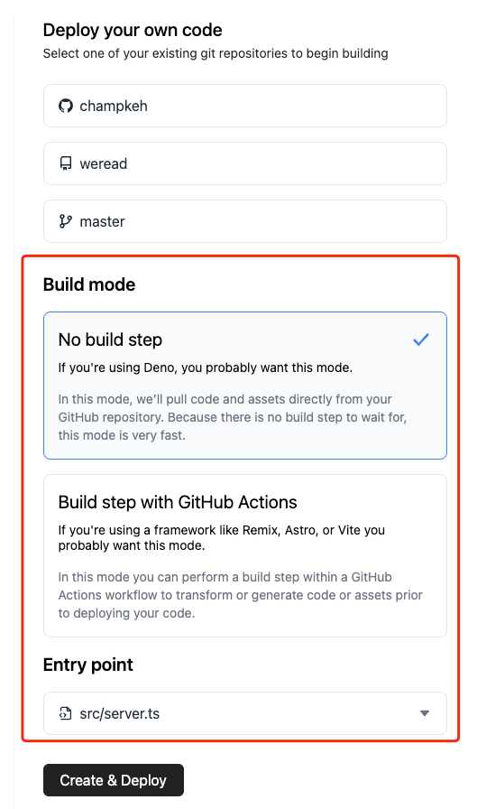
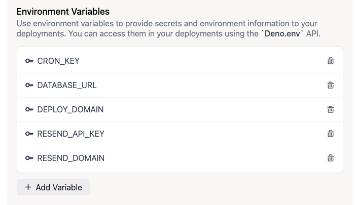
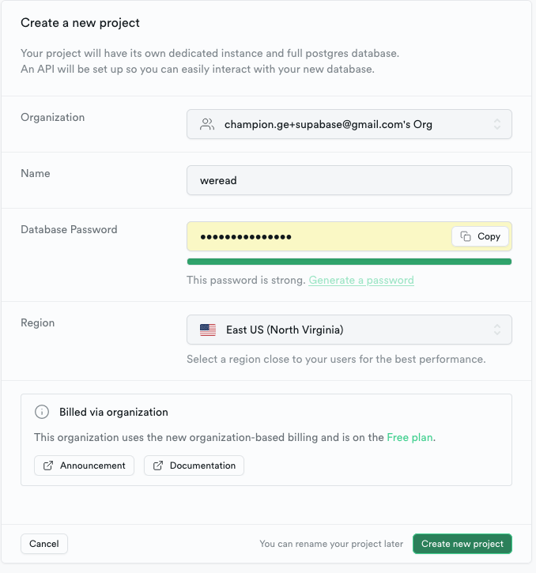
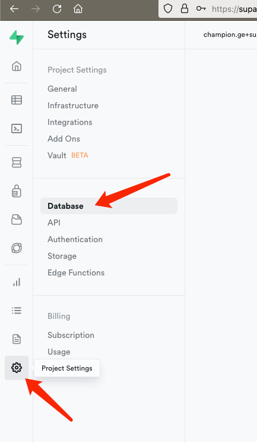
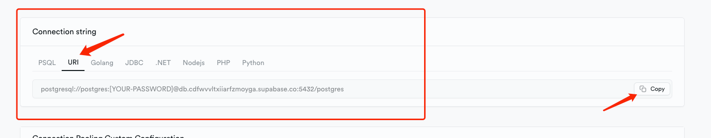
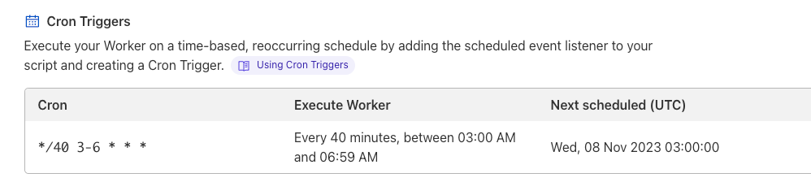
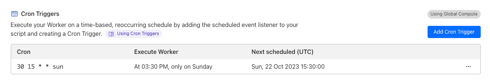
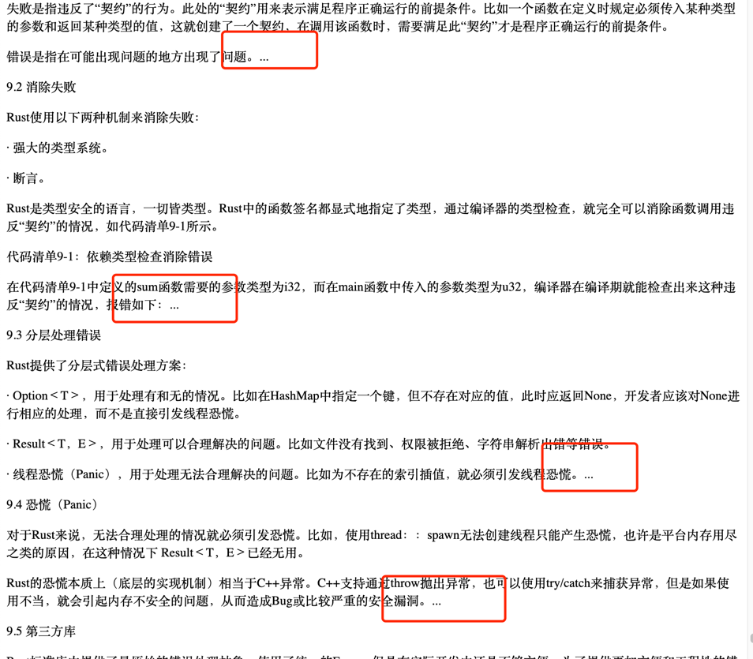
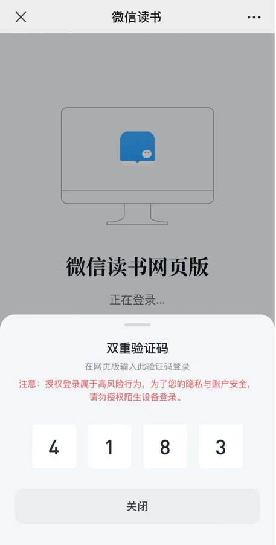

# wereadx

微信读书辅助工具，数据来自于微信读书网页版

## 声明
**本软件只能下载用户可访问的书籍，不支持下载需付费才能查看的书籍，请勿用于非法用途！本软件作者不对滥用行为承担任何赔偿责任。**

## ⚠️警告⚠️
**不要同时下载多本书，不但容易下载失败，还可能导致被微信读书封号处理！！！**

## 功能列表

1. 下载书架上的书到本地，仅支持下载 **html** 和 **epub** 格式
2. 自动更新阅读时长，可用于刷“读书排行榜”或者“阅读挑战赛”
3. 每周日晚 23:30 自动领取“时长兑福利”中的免费体验卡(暂未对外开放)
4. 支持下载用户自己上传的 pdf 格式的书


## 本地运行

> 需要提前安装 deno，参考官方的[安装指南](https://docs.deno.com/runtime/manual/getting_started/installation)

```shell
deno task dev
```
或者
```shell
npm run dev
```
或者
```shell
yarn dev
```


## 部署指南

> 如果想要自己部署，可参考以下步骤进行部署，目前仅支持部署到 Deno Deploy。
> 如果不想自己部署，可以使用 https://weread.deno.dev 公共服务，但会有限制，比如下载次数限制为每月100次，不支持自动领取体验卡等。

### 1. fork 本项目

### 2. 新建 Deno Deploy 项目，配置如下:


### 3. 部署完成，在 Deno Deploy 的设置页面，添加环境变量 (可选)


> 环境变量说明:
> 
> 目前只需要配置一个环境变量: `DATABASE_URL`，作用是为了在下载成功之后记录一下书籍下载记录，相关代码可以在`src/kv/download.ts`中查看。
>

<details>
<summary>获取 DATABASE_URL</summary>

#### 关于这个环境变量的获取：
注册 https://supabase.com/ 账号，创建一个新的项目，如下图：



> **保存这个数据库密码，后面连接字符串需要使用**

等待项目创建成功后，进入**Project Settings**里面的**Database**：



找到 **连接字符串** 面板，切换到`URI`，这个就是`DATABASE_URL`。注意需要用上面保存的数据库密码替换里面的`[YOUR-PASSWORD]`部分。


</details>


### 4. 设置定时任务
自动阅读和兑换体验卡都需要定时任务来触发执行，目前deno deploy自己的消息队列不太好用，所以采用 cloudflare 的 worker 来作为定时任务的触发器。

#### 自动阅读的触发器
在 CloudFlare 控制台添加一个 worker，代码如下：
```js
export default {
    async scheduled(event, env, ctx) {
        // 注意：此处的域名替换成你自己部署的域名
        const resp = await fetch('https://[your.domain.com]/cron/read/v2')
        console.log(await resp.text())
    },
};
```
设置 cron 触发周期为 `*/30 * * * *`，如下图所示：


#### 自动兑换体验卡的触发器
worker代码如下：
```js
export default {
    async scheduled(event, env, ctx) {
        // 注意：此处的域名替换成你自己部署的域名
        const resp = await fetch('https://[your.domain.com]/cron/exchange-awards')
        console.log(await resp.text())
    },
};
```
触发周期设置为 `30 15 * * sun`(北京时间每周日晚11点30分)，如下图所示：



## 特别注意

### 1. 关于付费内容
本项目不支持下载 **需要付费才能查看** 的内容，该内容通常表现为每章只有开头的一段内容，后面跟着省略号，如下图所示：



### 2. 关于双重验证码

扫码登录时会提示下面的二次确认，但实际上并不需要输入这个验证码也可以登录成功。



这个应该是属于微信读书的bug，后续如果微信读书调整的话，我再跟进处理这个问题。


## 后续计划

- 解决 issue 中的 bug 及提出的优化点；
- 优化网站样式；
- 导出书籍中的的笔记/划线；


## Stargazers over time

[](https://starchart.cc/champkeh/wereadx)
